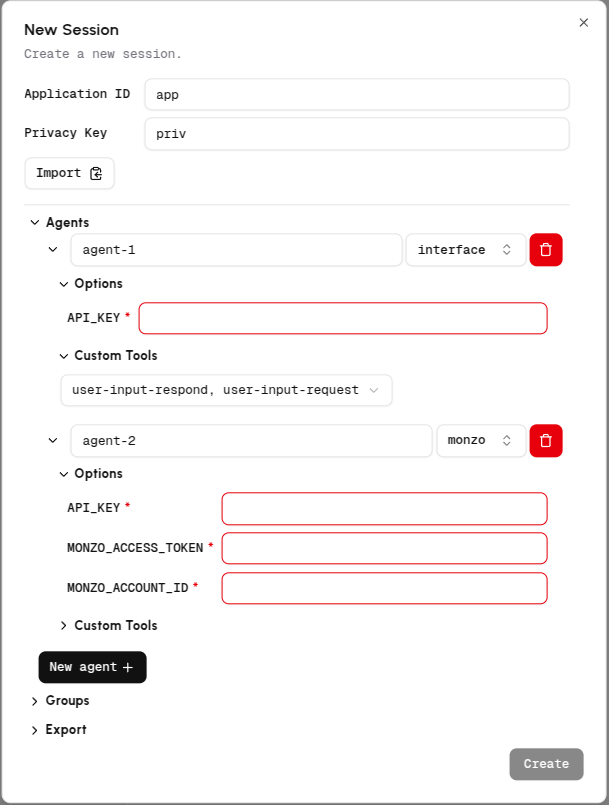

# Coral Raise Your Hack Guide

## About Raise Your Hack 💻
This is your chance to push boundaries, solve real-world challenges, and create impact at the official hackathon of the [RAISE Summit 2025](https://www.raisesummit.com/) at one of Paris's most iconic venues: Le Carrousel du Louvre. RAISE Summit 2025 is a premier event convening the brightest minds across industries to accelerate innovation and drive the future of entrepreneurship, AI, and technology.

## About Coral Protocol 🪸

The [Coral Protocol](https://www.coralprotocol.org/) is an initiative to create an open, standardized infrastructure for AI agent coordination. It builds on the MCP framework to enable multiple AI agents to work together collaboratively, addressing the limitation of isolated AI systems that lack mechanisms for interconnected workflows. The Coral Protocol focuses on:

- Agent Collaboration: Allowing AI agents to communicate, share tasks, and coordinate in a structured way.

- Messaging Layer: Providing a system for agents to exchange messages, similar to human messaging platforms, with features like threads and mentions.

- Scalability and Openness: Designing an extensible, open-source solution that can support a wide range of AI applications, from customer support to project management.

We released the [Coral Server](https://github.com/Coral-Protocol/coral-server) as an open-source MCP server to serve as the backbone for this vision. The server acts as a messaging hub where AI agents can register, communicate via threads, and coordinate tasks by mentioning each other. The protocol aims to foster a community-driven ecosystem, encouraging developers to experiment, contribute, and build collaborative AI systems.

## About the Tracks 🎯

Coral Protocol is encouraged for teams interested in multi-agent systems, allowing them to integrate open-source agents from any framework. With its thread-based agent architecture, Coral enables scalable and predictable multi-agent interactions, making it a powerful tool for innovative applications. Checkout how to build on the below track using Coral Protocol.

### Qualcomm Track

🧠 Edge AI Consumer Utility Application

<details>

Build a powerful, AI-driven utility app for everyday users—right at the edge.
In this track, you'll will develop a consumer-facing utility application that runs entirely on-device using the Snapdragon X Elite platform. The challenge is to harness the power of Edge AI to create a tool that is both useful and accessible to a broad audience—without relying on cloud connectivity.

🔍 What We’re Looking For:

• Consumer-Oriented: The app should appeal to a wide range of users and offer clear, everyday value.
• Utility-Focused: It must help users accomplish a task—whether it's organizing, creating, assisting, or enhancing their experience.
• Edge AI-Powered: The core functionality should include a probabilistic AI component (e.g., computer vision, audio processing, or generative AI) that runs locally in a resource-constrained environment.
• Cross-Platform: While the app targets Snapdragon X Elite, it should be compatible with Windows, macOS, and Linux.
• Developer-Ready: Submissions should include a GitHub repository with setup and run instructions. A polished consumer UI is not required—focus on functionality and innovation.

🛠️ Tech Flexibility:

• Use any programming language or framework.
• Combine multiple AI modalities (CV, audio, Gen AI) as needed.
• No internet connection should be required for core functionality.

Qualcomm will directly ship the Copilot+ PC with the Snapdragon® X Elite (loaner devices) to selected participants and collect them at the conclusion of the hackathon.

The hardware will be shipped on June 30th with next-day delivery.

</details>

### Coral Example Usage: Personal Finance Advisor

- Personal finance advisor system that  to provides secure, intelligent, and privacy-preserving financial management through natural language interaction using Coral Monzo Agent.
- The Monzo Agent enables users to safely access and analyze their Monzo banking data using a local LLM/LLM provided by Groq, ensuring sensitive information never leaves their device. By integrating with Monzo’s official API and customized toolkits, the system supports conversational account balance checks, transaction history queries, and personalized financial advice.
- Agents: [Interface Agent](https://github.com/Coral-Protocol/Coral-Interface-Agent) | [Monzo Agent](https://github.com/Coral-Protocol/Coral-Monzo-Agent)
- [Demo Video](https://drive.google.com/file/d/1carCDjr-sZbTs5OOmzwSPsLItCwbnW0Y/view?usp=sharing)


<details>

### 1. Setup Coral Server and Coral Studio

<details>

- To setup the [Coral Server](https://github.com/Coral-Protocol/coral-server) and [Coral Studio UI](https://github.com/Coral-Protocol/coral-studio), follow the steps given in repository to install.

- In order to test if both are working, open the same instance in two terminals and run both simultaneously.

```bash
# run studio
yarn dev
```
- You will see both running like this simultaneously if succesful and should be able to access Coral Studio from your browser.


- On Coral Studio, ensure the connection to Coral Server.


<details>

<summary>Install Java if UNAVAILABLE in order to run Coral Server</summary>

Install Java

```bash

# Apt update
sudo apt update

# Install the JDK
sudo apt install openjdk-17-jdk

# Check version
java -version
```

Run Coral Server

```bash

./gradlew run

```

</details>

<details>

<summary>Install Yarn if UNAVAILABLE in order to run Coral Studio</summary>

Install Yarn

```bash
# Download and install nvm:
curl -o- https://raw.githubusercontent.com/nvm-sh/nvm/v0.40.3/install.sh | bash

# in lieu of restarting the shell
\. "$HOME/.nvm/nvm.sh"

# Download and install Node.js:
nvm install 22

# Verify the Node.js version:
node -v # Should print "v22.17.0".
nvm current # Should print "v22.17.0".

# Download and install Yarn:
corepack enable yarn

# Verify Yarn version:
yarn -v

# Install from yarn
yarn install

# Allow port for eternal access
sudo ufw allow 5173

```

Run Coral Studio

```bash

yarn dev

```

</details>

</details>

### 2. Setup the Agents

<details>  

- Terminate the Coral Server and Coral Studio connections from above and start below steps.
- In this example, we are using the agents: [Coral Interface Agent](https://github.com/Coral-Protocol/Coral-Interface-Agent) and [Coral Monzo Agent](https://github.com/Coral-Protocol/Coral-Monzo-Agent).  
- Please click on the link and set up the agents by following the setup instructions in the repository.  
- Check the output below to see how the terminal will look after succesfull installation, keep in mind the directory you are at while doing `uv sync`.


</details>

### 3. Run the Agents

<details>

<summary>You can run in either of the below modes to get your system running.</summary>

#### 1. Executable Mode

<details>

- The Executable Mode is part of the Coral Protocol Orchestrator which works with [Coral Studio UI](https://github.com/Coral-Protocol/coral-studio).  

- Checkout: [How to Build a Multi-Agent System with Awesome Open Source Agents using Coral Protocol](https://github.com/Coral-Protocol/existing-agent-sessions-tutorial-private-temp).  

- Update the file: `coral-server/src/main/resources/application.yaml` with the details below. 

```bash
# replace "root" with YOUR/PROJECT/DIRECTORY if different

applications:
  - id: "app"
    name: "Default Application"
    description: "Default application for testing"
    privacyKeys:
      - "default-key"
      - "public"
      - "priv"

registry:
  interface:
    options:
      - name: "API_KEY"
        type: "string"
        description: "API key for the service"
    runtime:
      type: "executable"
      command: ["bash", "-c", "/root/Coral-Interface-Agent/run_agent.sh main.py"]
      environment:
        - name: "API_KEY"
          from: "API_KEY"
        - name: "MODEL_NAME"
          value: "gpt-4.1"
        - name: "MODEL_PROVIDER"
          value: "openai"
        - name: "MODEL_TOKEN"
          value: "16000"
        - name: "MODEL_TEMPERATURE"
          value: "0.3"
          
  monzo:
    options:
      - name: "API_KEY"
        type: "string"
        description: "API key for the service"
      - name: "MONZO_ACCESS_TOKEN"
        type: "string"
        description: "MONZO_ACCESS_TOKEN"
      - name: "MONZO_ACCOUNT_ID"
        type: "string"
        description: "MONZO_ACCOUNT_ID"
    runtime:
      type: "executable"
      command: ["bash", "-c", "/root/Coral-Monzo-Agent/run_agent.sh main.py"]
      
      environment:
        - name: "API_KEY"
          from: "API_KEY"
        - name: "MODEL"
          value: "llama-3.3-70b-versatile"
        - name: "LLM_MODEL_PROVIDER"
          value: "groq"
        - name: "MONZO_ACCESS_TOKEN"
          from: "MONZO_ACCESS_TOKEN"
        - name: "MONZO_ACCOUNT_ID"
          from: "MONZO_ACCOUNT_ID"
```

- Run the [Coral Server](https://github.com/Coral-Protocol/coral-server) and [Coral Studio](https://github.com/Coral-Protocol/coral-studio). 

- You do not need to set up the `.env` in the project directory for running in this mode; it will be captured through the variables below.  

- After the agents are loaded properly, you will see "2 agents" connected. Proceed ahead with "Select Session", add the agents, api key and esure to add both the Custom Tools to the Interface Agent.

  

</details>

#### 2. Dev Mode

<details>

- The Dev Mode allows the Coral Server and all agents to be seaprately running on each terminal without UI support.  

- Ensure that the [Coral Server](https://github.com/Coral-Protocol/coral-server) is running on your system and run below commands in separate terminals.

- Ensure that you have setup the `.env` file with required keys.  

Run the Interface Agent

```bash
# cd to directory
cd Coral-Interface-Agent

# Run the agent using `uv`:
uv run python main.py
```

Run the Pandas Agent

```bash
# cd to directory
cd Coral-Monzo-Agent

# Run the agent using `uv`:
uv run python main.py
```

</details>

</details>

</details>

(NOTE: The examples above are just to demonstrate how to use Coral. For the hackathon you have to create you own use case by either selecting from the list of agents from our [awesome agent list](https://github.com/Coral-Protocol/awesome-agents-for-multi-agent-systems) or create your own agents compatible on Coral.)

