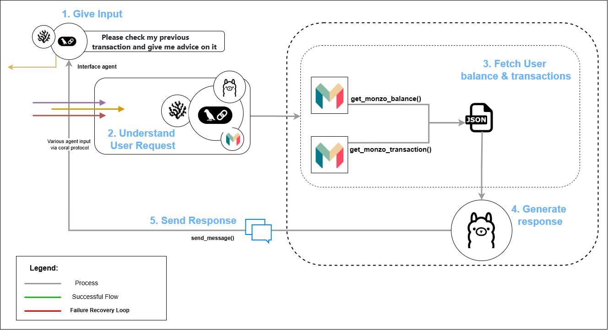

# Qualcomm: Agentic Finance Tracker System w Llama on Qualcomm

This guide helps you build an AI-driven utility app for everyday users—right at the edge for the Qualcomm Challenge using Coral Protocol and multi-agent collaboration. Follow step-by-step setup instructions for agents, server, and UI.

### Introduction

- The Qualcomn Track challenges you to build a a powerful, AI-driven utility app for everyday users—right at the edge using the Coral Protocol, an open, standardized framework for AI agent collaboration. Coral enables multiple AI agents to communicate, share tasks, and coordinate through a structured messaging layer with threads and mentions. 

- The example of Coral Protocol solution is a Personal finance advisor system that provides secure, intelligent, and privacy-preserving financial management through natural language. The Personal finance advisor enables users to safely access and analyze their Monzo banking data using a local LLM/LLM provided by Groq, ensuring sensitive information never leaves their device. By integrating with Monzo’s official API and customized toolkits, the system supports conversational account balance checks, transaction history queries, and personalized financial advice.
- Agents: [Interface Agent](https://github.com/Coral-Protocol/Coral-Interface-Agent) | [Monzo Agent](https://github.com/Coral-Protocol/Coral-Monzo-Agent)
- [Demo Video](https://screen.studio/share/hbhDOITn)

  

### Outline

- **Setup Coral Server and Coral Studio**  
  Step-by-step guide to install and run Coral Server and Coral Studio with necessary dependencies (Java, Yarn, Node.js).

- **Setup the Agents**  
  Instructions to install and configure the Interface Agent and Monzo Agent using uv.

- **Run the Agents**  
  Available options to run agents:
  - Executable Mode with Coral Studio Orchestrator  
  - Dev Mode (terminal-based) for easier debugging  

- **Example**  
  Sample input and output to get results.


### How to run step by step

### 1. Setup Coral Server and Coral Studio

<details>

- To setup the [Coral Server](https://github.com/Coral-Protocol/coral-server) and [Coral Studio UI](https://github.com/Coral-Protocol/coral-studio), follow the steps given in repository to install.

- In order to test if both are working, open the same instance in two terminals and run both simultaneously.

```bash
# run studio
yarn dev
```
- You will see both running like this simultaneously if succesful and should be able to access Coral Studio from your browser.


- On Coral Studio, ensure the connection to Coral Server.


<details>

<summary>Install Java if UNAVAILABLE in order to run Coral Server</summary>

Install Java

```bash

# Apt update
sudo apt update

# Install the JDK
sudo apt install openjdk-17-jdk

# Check version
java -version
```

Run Coral Server

```bash

./gradlew run

```

</details>

<details>

<summary>Install Yarn if UNAVAILABLE in order to run Coral Studio</summary>

Install Yarn

```bash
# Download and install nvm:
curl -o- https://raw.githubusercontent.com/nvm-sh/nvm/v0.40.3/install.sh | bash

# in lieu of restarting the shell
\. "$HOME/.nvm/nvm.sh"

# Download and install Node.js:
nvm install 22

# Verify the Node.js version:
node -v # Should print "v22.17.0".
nvm current # Should print "v22.17.0".

# Download and install Yarn:
corepack enable yarn

# Verify Yarn version:
yarn -v

# Install from yarn
yarn install

# Allow port for eternal access
sudo ufw allow 5173

```

Run Coral Studio

```bash

yarn dev

```

</details>

</details>

### 2. Setup the Agents

<details>  

- Terminate the Coral Server and Coral Studio connections from above and start below steps.
- In this example, we are using the agents: [Coral Interface Agent](https://github.com/Coral-Protocol/Coral-Interface-Agent) and [Coral Monzo Agent](https://github.com/Coral-Protocol/Coral-Monzo-Agent).  
- Please click on the link and set up the agents by following the setup instructions in the repository.  
- Check the output below to see how the terminal will look after succesfull installation, keep in mind the directory you are at while doing `uv sync`.


</details>

### 3. Run the Agents

<details>

<summary>You can run in either of the below modes to get your system running.</summary>

#### 1. Executable Mode

<details>

- The Executable Mode is part of the Coral Protocol Orchestrator which works with [Coral Studio UI](https://github.com/Coral-Protocol/coral-studio).  

- Checkout: [How to Build a Multi-Agent System with Awesome Open Source Agents using Coral Protocol](https://github.com/Coral-Protocol/existing-agent-sessions-tutorial-private-temp).  

- Update the file: `coral-server/src/main/resources/application.yaml` with the details below. 

```bash
# replace "root" with YOUR/PROJECT/DIRECTORY if different

applications:
  - id: "app"
    name: "Default Application"
    description: "Default application for testing"
    privacyKeys:
      - "default-key"
      - "public"
      - "priv"

registry:
  interface:
    options:
      - name: "API_KEY"
        type: "string"
        description: "API key for the service"
    runtime:
      type: "executable"
      command: ["bash", "-c", "/root/Coral-Interface-Agent/run_agent.sh main.py"]
      environment:
        - name: "API_KEY"
          from: "API_KEY"
        - name: "MODEL_NAME"
          value: "gpt-4.1"
        - name: "MODEL_PROVIDER"
          value: "openai"
        - name: "MODEL_TOKEN"
          value: "16000"
        - name: "MODEL_TEMPERATURE"
          value: "0.3"
          
  monzo:
    options:
      - name: "API_KEY"
        type: "string"
        description: "API key for the service"
      - name: "MONZO_ACCESS_TOKEN"
        type: "string"
        description: "MONZO_ACCESS_TOKEN"
      - name: "MONZO_ACCOUNT_ID"
        type: "string"
        description: "MONZO_ACCOUNT_ID"
    runtime:
      type: "executable"
      command: ["bash", "-c", "/root/Coral-Monzo-Agent/run_agent.sh main.py"]
      
      environment:
        - name: "API_KEY"
          from: "API_KEY"
        - name: "MODEL"
          value: "llama-3.3-70b-versatile"
        - name: "LLM_MODEL_PROVIDER"
          value: "groq"
        - name: "MONZO_ACCESS_TOKEN"
          from: "MONZO_ACCESS_TOKEN"
        - name: "MONZO_ACCOUNT_ID"
          from: "MONZO_ACCOUNT_ID"
```

- Run the [Coral Server](https://github.com/Coral-Protocol/coral-server) and [Coral Studio](https://github.com/Coral-Protocol/coral-studio). 

- You do not need to set up the `.env` in the project directory for running in this mode; it will be captured through the variables below.  

- After the agents are loaded properly, you will see "2 agents" connected. Proceed ahead with "Select Session", add the agents, api key and esure to add both the Custom Tools to the Interface Agent.

  

</details>

#### 2. Dev Mode

<details>

- The Dev Mode allows the Coral Server and all agents to be seaprately running on each terminal without UI support.  

- Ensure that the [Coral Server](https://github.com/Coral-Protocol/coral-server) is running on your system and run below commands in separate terminals.

- Ensure that you have setup the `.env` file with required keys.  

Run the Interface Agent

```bash
# cd to directory
cd Coral-Interface-Agent

# Run the agent using `uv`:
uv run python main.py
```

Run the Monzo Agent

```bash
# cd to directory
cd Coral-Monzo-Agent

# Run the agent using `uv`:
uv run python main.py
```

</details>

</details>


### 5. Example

<details>

```bash
# Input:
Question: Help me check my transections of monzo for the last 2 months and give me some personal finance advice.

# Output:
Answer: Here is a summary of your Monzo transactions for the past 2 months:
- May 1: -£22.00 (University, bills)
- May 14: -£120.00 (Person A, general)
- May 14: -£20.81 (Mobile Provider, bills)
- May 18: -£16.00 (Person A, general)
- May 19: +£9.00 (Person B, income)
- June 2: -£22.00 (University, bills)
- June 6: +£6.66 (From Person C, income)
- June 12: -£20.81 (Mobile Provider, bills)
- June 17: +£100.00 (From Person C, income)

Notable spending patterns:
- Regular bills to University and Mobile Provider.
- Significant general spending to "Person A."
- Income from Person B and Person C.

Personalized financial advice:
1. **Track Recurring Bills:** Your regular payments to University and Mobile Provider are predictable. Consider setting up automated budgeting for these to ensure you always have funds allocated.
2. **Review Large Expenses:** The £120 payment to "Person A" stands out. Review such large transactions to ensure they are necessary and look for ways to reduce or avoid them if possible.
3. **Increase Savings:** Try to set aside a portion of your income (even small amounts) right after you receive it. Automating savings can help build a financial cushion.
4. **Monitor Cash Flow:** Your income is irregular. Consider ways to stabilize your income or reduce discretionary spending during lower-income months.
5. **Analyze General Spending:** Categorize your general expenses to identify areas where you can cut back.

Would you like more detailed budgeting tips or help setting up a savings plan?

Is there anything else I can help you with?
```

</details>

</details>


### Where to find support 

If you have any questions about anything you can join our discord here, and put something in the dev support channel, if you beleivie it to be a bug or a feate that you want you can add it as a github issue [Discord](https://discord.com/invite/Xjm892dtt3)


